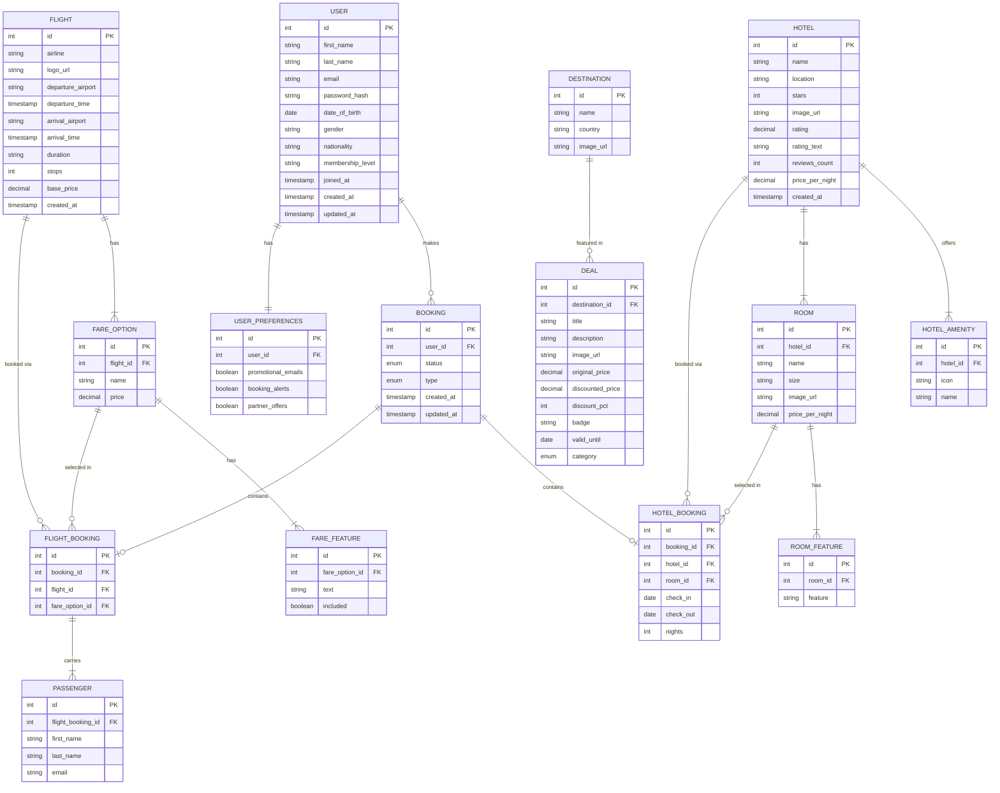

# Roamio — Database Schema (ERD)

## Enum Values

| Table | Column | Values |
|---|---|---|
| `BOOKING` | `status` | `confirmed`, `pending`, `cancelled` |
| `BOOKING` | `type` | `flight`, `hotel`, `both` |
| `DEAL` | `category` | `flight`, `hotel`, `package` |

## Key Relationships Summary

| Relationship | Cardinality | Description |
|---|---|---|
| User → UserPreferences | 1 : 1 | Each user has one preferences record |
| User → Booking | 1 : N | A user can have many bookings |
| Booking → FlightBooking | 1 : 0..1 | A booking may include a flight leg |
| Booking → HotelBooking | 1 : 0..1 | A booking may include a hotel stay |
| Flight → FareOption | 1 : N | A flight offers multiple fare classes |
| FareOption → FareFeature | 1 : N | Each fare class lists its included features |
| Hotel → Room | 1 : N | A hotel offers multiple room types |
| Hotel → HotelAmenity | 1 : N | A hotel lists its amenities |
| Room → RoomFeature | 1 : N | Each room type lists its features |
| FlightBooking → Passenger | 1 : N | A flight booking covers N passengers |
| Destination → Deal | 1 : N | A destination can have multiple deals |
